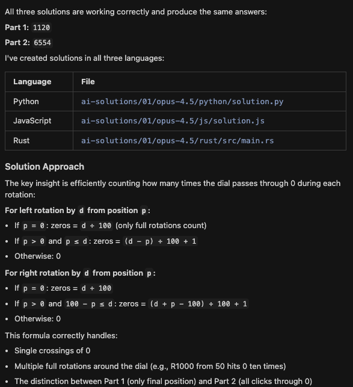

Tokens used: 606.2K

- Thought for 1m 2s before touching code
- Really thorough output:
  
- Ran individually rather than using the run_solutions.py script again
- Actual implementation was quick, thought more up front
- Read the run_solutions.py script to learn how to run the solutions and to expect a file path arg